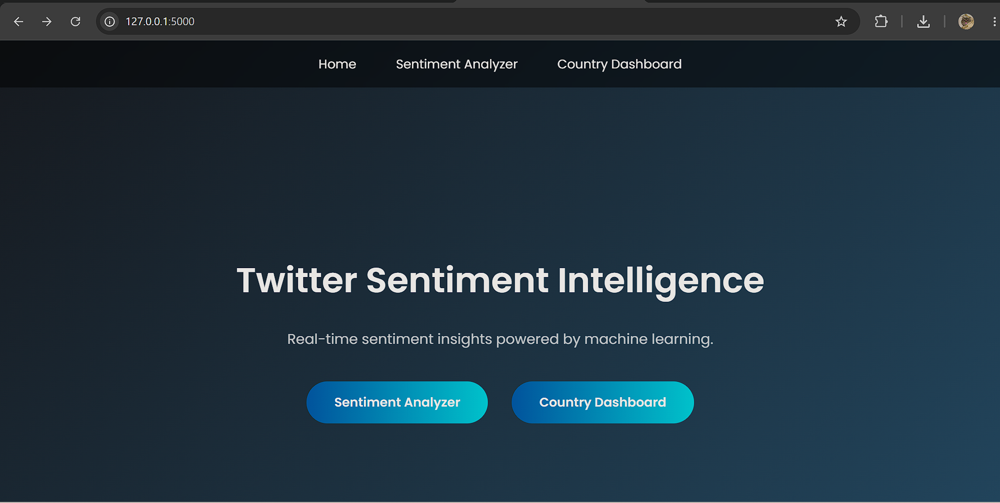
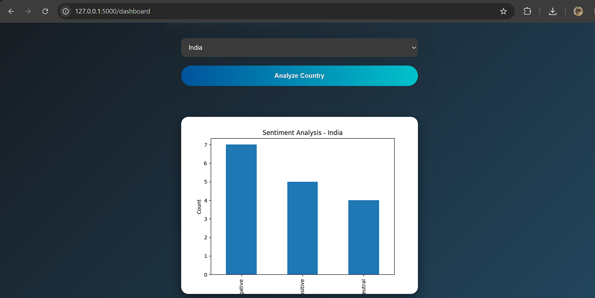
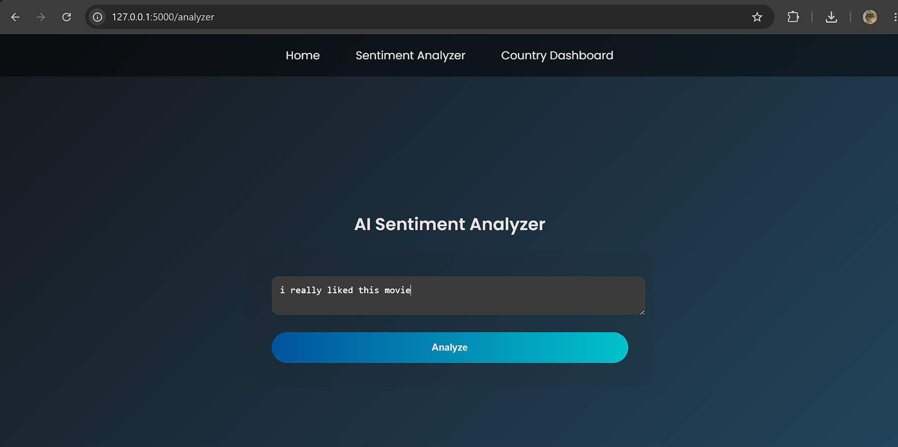
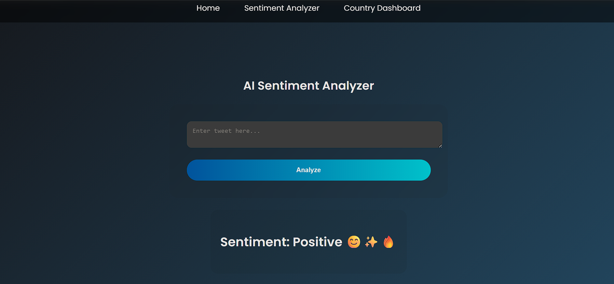
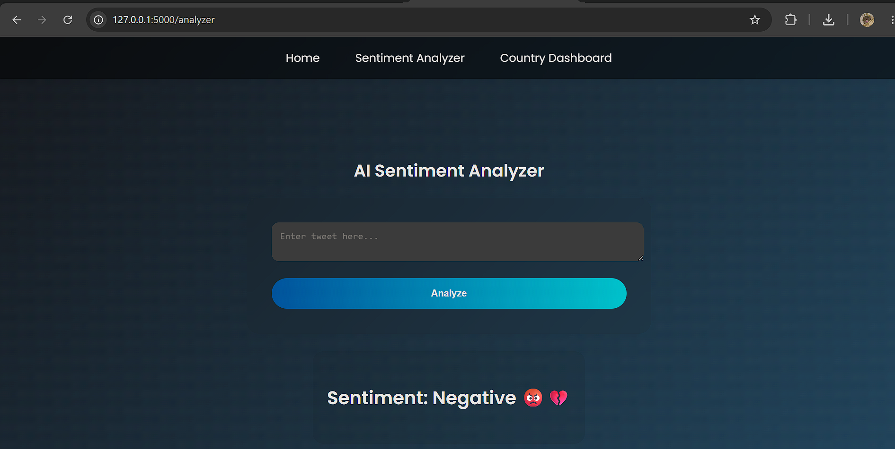

# 🐦 Twitter Sentiment Analysis using Machine Learning

## 📖 Project Overview

This project is a Flask-based web application that predicts the sentiment of tweets using a Machine Learning model. Users can enter any tweet or text, and the application classifies it as **Positive**, **Negative**, or **Neutral**. The project also includes an interactive dashboard with visual analytics to help users understand sentiment trends.

---

## 🚀 Features

- Predicts tweet sentiment
- Interactive web interface
- Machine Learning based prediction
- Dashboard with charts
- Clean and responsive UI
- Real-time sentiment analysis

---

## 🛠 Technologies Used

- Python
- Flask
- HTML5
- CSS3
- JavaScript
- Scikit-learn
- Pandas
- NumPy
- Pickle
- VS Code

---

## 📂 Project Structure

```
Twitter-Sentiment-Analysis
│
├── app.py
├── static/
├── templates/
├── screenshots/
├── README.md
├── sentiment_model.pkl
├── vectorizer.pkl
└── requirements.txt
```

---

# 📸 Project Screenshots

## 🏠 Home Page



---

## 📊 Dashboard


---

## 📈 Charts



---

## 😊 Positive Prediction



---

## 😊 Another Positive Prediction



---

## 😞 Negative Prediction


---

## 😞 Another Negative Prediction



---

## ⚙️ Installation

Clone the repository

```bash
git clone https://github.com/uzma9658-code/Twitter-Sentiment-Analysis.git
```

Install the required packages

```bash
pip install -r requirements.txt
```

Run the application

```bash
python app.py
```

Open your browser

```
http://127.0.0.1:5000
```

---

## 📌 Future Improvements

- Deploy to cloud hosting
- Improve prediction accuracy
- User authentication
- Dark mode
- Download prediction reports
- Real-time Twitter API integration

---

## 👩‍💻 Author

**Uzma Shaikh**

Bachelor of Data Science

Machine Learning & Data Analytics Enthusiast

---

⭐ If you found this project useful, consider giving it a Star.
